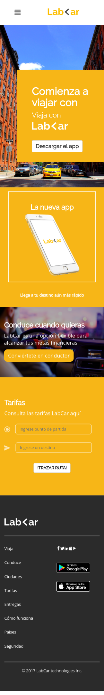
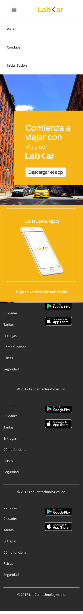
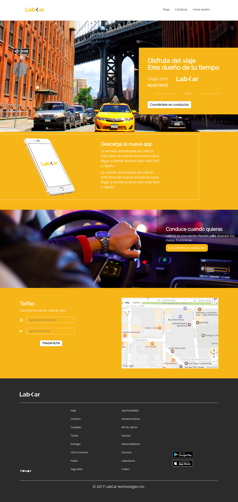

# LabCar
Este proyecto es realizado con la finalidad de explotar lo aprendido durante el Sprint
## Description
 Este proyecto está constituido por los temas que se encuentra entre:
```sh
  - API GOOGLE
  - grillas de Bootstrap
  - Flexbox
  - Floating
  - Maquetación hecho en mobile(se uso Galaxy5)
  -
```
## Desarrollado 
   ```sh
  - HTML
  - JS
  - CSS
  - FRAMEWORK BOOTSTRAP
  - ICON MOONS
```
## Muestra del Proyecto
+ Mobile  
  
+ Mobile with nav 
  
 + Desktop
  
 
 

`Nota`: Este proyecto está subido al GH-PAGES [website](https://mgmp2.github.io/LabCar/).
